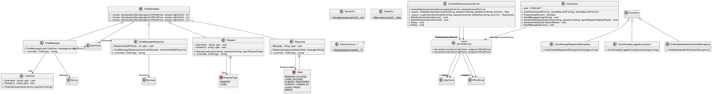

# Code Documentation

This is the documentation for the source code of this project. Autogenerated from XML comments in the source code using [DocFX](https://dotnet.github.io/docfx/).

In this documentation you will find information about the structure of the code, the namespaces and the classes.

## Table of contents

- [Code Documentation](#code-documentation)
  - [Table of contents](#table-of-contents)
  - [Solution structure](#solution-structure)
    - [Namespace structure](#namespace-structure)
      - [Available namespaces](#available-namespaces)
  - [How to generate the documentation](#how-to-generate-the-documentation)
  - [PlantUML diagrams](#plantuml-diagrams)

## Solution structure

This dotnet solution is composed of 3 CS-projects:

- 2 projects for entities that are compiled into executables.
  - `UdpChat.Client` - The client application.
  - `UdpChat.Server` - The server application.
- 1 project for the shared code between client and server.
  - `UdpChat.Lib` - The shared code between the client and the server.

### Namespace structure

This solution uses namespaces to separate the each CS-project's code. See the [Available namespaces](#available-namespaces) section for more information.

#### Available namespaces

- [Client](UdpChat.Client.yml) : Client logic.
  - [Client.CLI](UdpChat.Client.CLI.yml) : CLI logic. Client entry point.
- [Server](UdpChat.Server.yml) : Server logic.
  - [Server.CLI](UdpChat.Server.CLI.yml) : CLI logic. Server entry point.
  - [Server.Exceptions](UdpChat.Server.Exceptions.yml) : Exceptions used by the server.
- [Lib](UdpChat.Lib.yml) : Shared code between the client and the server. All Serializable classes represent the payloads being sent between user and server. This works by transforming the class into a JSON and the serializing that JSON. As it is a JSON it can be sent over the network, recieved, deserialized and transformed back into a class representing the payload.
  - [Lib.ChatUser](UdpChat.Lib.ChatUser.yml) : Serialiable class representing a client as a user.
  - [Lib.Message](UdpChat.Lib.Message.yml) : Serializable class representing a message.
  - [Lib.Authentication](UdpChat.Lib.Authentication.yml) : Serialiable Authentication classes representing an Auth request and response.

## How to generate the documentation

1. Install DocFX. See [here](https://dotnet.github.io/docfx/tutorial/docfx_getting_started.html#2-use-docfx-as-a-command-line-tool) for more information.
    - (Optional) Install [wkhtmltopdf](https://wkhtmltopdf.org/downloads.html) for PDF generation.
2. Run `docfx metadata docfx_project/docfx.json && docfx build docfx_project/docfx.json` from the root of the repository.
    - (Optional) Run `docfx metadata docfx_project/docfx.json && docfx pdf docfx_project/docfx.json` to generate a PDF version of the documentation.
3. The generated documentation will be in the `docfx_project/` folder, more specifically:
    - `docfx_project/_site/` for the HTML documentation.
    - `docfx_project/_site_pdf/` for the PDF version of the documentation.

## PlantUML diagrams

This solution uses PlantUML to generate diagrams. See the [PlantUML website](https://plantuml.com/) for more information.
<!-- insert diagram -->

