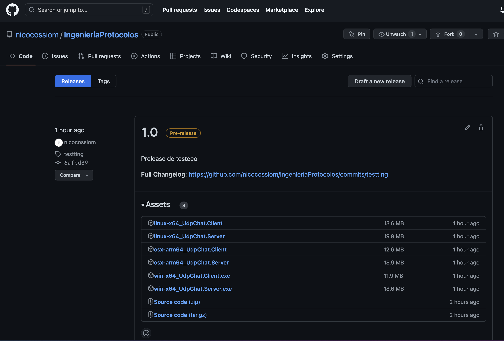

# Client CLI Documentation

This CLI can be used to interact with a server in otder to register, login, send messages, etc.

## Table of contents

- [Client CLI Documentation](#client-cli-documentation)
  - [Table of contents](#table-of-contents)
  - [Usage](#usage)
    - [Default settings](#default-settings)
    - [Custom settings](#custom-settings)
    - [Commands](#commands)
  - [Installation](#installation)
    - [With dotnet (.NET)](#with-dotnet-net)
    - [Binary executable](#binary-executable)
      - [Latest release download](#latest-release-download)
      - [Github Releases page](#github-releases-page)
      - [Add to PATHV](#add-to-pathv)
        - [MacOS and Linux](#macos-and-linux)
        - [Windows CMD or Powershell](#windows-cmd-or-powershell)
  - [Excute the client CLI](#excute-the-client-cli)
    - [Binary](#binary)
      - [Windows](#windows)
      - [MacOS](#macos)
      - [Linux](#linux)
    - [Dotnet (.NET)](#dotnet-net)

## Usage

### Default settings

```bash
$ UdpChat.Client
Welcome to the UDP chat client!

        Default settings:
        Client ports: Recieve 4000 - Send 4001
        Central Server: Adress 127.0.0.1 - Port 5000

Do you want to use the default settings? (y/n) (↩️  after input))
y
Client created at 4000 with central server at 127.0.0.1:5000
Messages that are sent by the server will be displayed, waiting for messages...
Input a command, available commands are
            - register
            - login
            - send
            - unregister
```

### Custom settings

```bash
$ UdpChat.Client
Welcome to the UDP chat client!

        Default settings:
        Client ports: Recieve 4000 - Send 4001
        Central Server: Adress 127.0.0.1 - Port 5000

Do you want to use the default settings? (y/n) (↩️  after input))
n
Enter a port for the client (enter for 4000):
4004
IP of central server (enter for 127.0.0.1):

Port of central server (enter for 5000):

    Client config:
        Client ports: Receive=4004 - Send=4005
        Central Server: Address=127.0.0.1 - Port=5000

Is this correct? (y/n)

Client created at 4004 with central server at 127.0.0.1:5000
Messages that are sent by the server will be displayed, waiting for messages...
Input a command, available commands are
            - register
            - login
            - send
            - unregister
```

### Commands

- register
- login
- send
- unregister

To see examples of using the client go to [examples](examples.md)

To exit the server in a controlled manner press `Ctrl + C`. This will ensure the client closes its
opened resources in an orderly fashion.

## Installation

There is no installer. There are 2 ways to get the client CLI:

### With dotnet (.NET)

```bash
git clone git@github.com:nicocossiom/IngenieriaProtocolos.git UDPChat
Cloning into 'UDPChat'...
remote: Enumerating objects: 584, done.
remote: Counting objects: 100% (584/584), done.
remote: Compressing objects: 100% (291/291), done.
remote: Total 584 (delta 340), reused 514 (delta 270), pack-reused 0
Receiving objects: 100% (584/584), 6.78 MiB | 1.57 MiB/s, done.
Resolving deltas: 100% (340/340), done.
```

### Binary executable

You can download a binary from the releases page and run it directly. There are binaries for Windowsx64, Linux64 and MacOSarm64.

#### Latest release download

- [Linux](https://github.com/nicocossiom/IngenieriaProtocolos/releases/download/latest/linux-x64_UdpChat.Client)
- [MacOS](https://github.com/nicocossiom/IngenieriaProtocolos/releases/download/latest/osx-arm64_UdpChat.Client)
- [Windows](https://github.com/nicocossiom/IngenieriaProtocolos/releases/download/latest/win-x64_UdpChat.Client.exe)

#### Github Releases page

You can laso go to the [releases page on Github](https://github.com/nicocossiom/IngenieriaProtocolos/releases/) to see all available releases and platforms.



After downloading the client move the file to a folder of your choice.

You can then place this folder wherever you want.
You can also add the folder to your PATH environment variable to be able to run the client from anywhere.

#### Add to PATHV

##### MacOS and Linux

```bash
export PATH=$PATH:/path/to/folder
```

##### Windows CMD or Powershell

Windows CMD in Admin mode

```cmd
set PATH=%PATH%;C:\path\to\folder
```

Windows Powershell in Admin mode

```powershell
$env:Path += ";C:\path\to\folder"
```

In Windows you can run the executable from the command line. Or from double clicking it.

## Excute the client CLI

### Binary

#### Windows

```bash
# Windows
win-x64_UdpChat.Client.exe
```

In MacOS and Linux you may need to give the executable permissions before running it.

#### MacOS

```bash
chmod +x osx-arm64_UdpChat.Client ./osx-arm64_UdpChat.Client
```

> Note: On MacOS you may need to open in Finder the folder where you have the binaries, then right Click -> Open to allow the executable to run
> you will get a popup saying something like:
> `"osx-arm64_UdpChat .Client" can't be opened because Apple cannot check it for malicious software. ...`. Click OK. And try again.

#### Linux

```bash
chmod +x linux-x64_UdpChat.Client && ./linux-x64_UdpChat.Client
```

### Dotnet (.NET)

````bash
cd UDPChat
````

```bash
dotnet run --project UdpChat.Client
Welcome to the UDP chat client!

        Default settings:
        Client ports: Recieve 4000 - Send 4001
        Central Server: Adress 127.0.0.1 - Port 5000

Do you want to use the default settings? (y/n) (↩️  after input))
```
