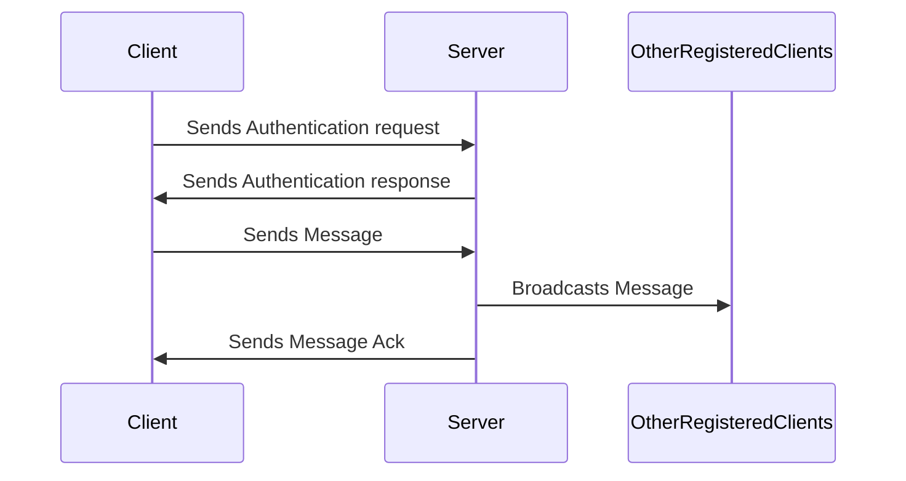
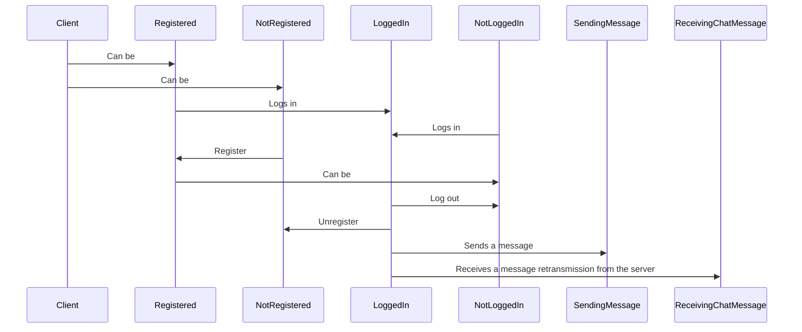
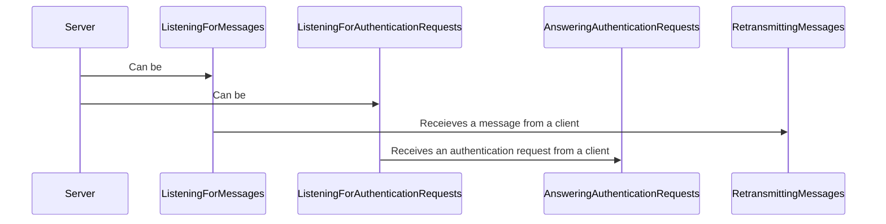

# UDP Multichat CLI Application

This chat app is a simple UDP client/server application that allows multiple clients
to connect to a server and send messages to each other. The server is able to handle
multiple clients at once and will broadcast messages to all connected clients.

## Basic functionality of a UDP Multichat

## Possible client states

## Possible server states

