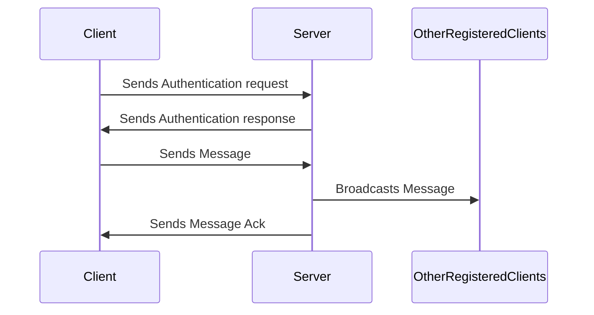
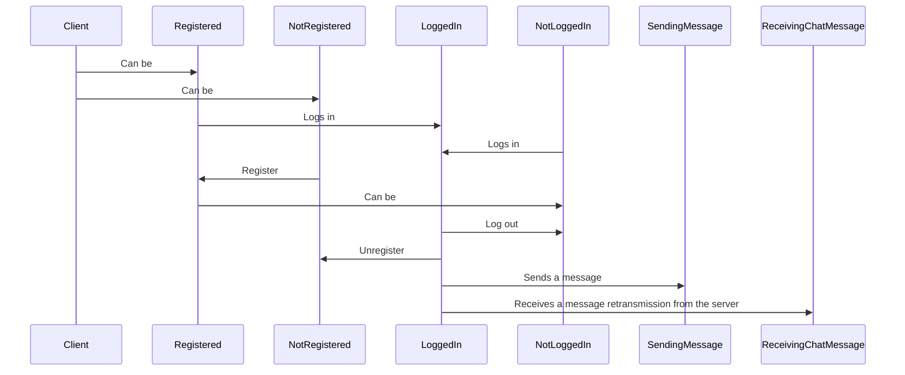
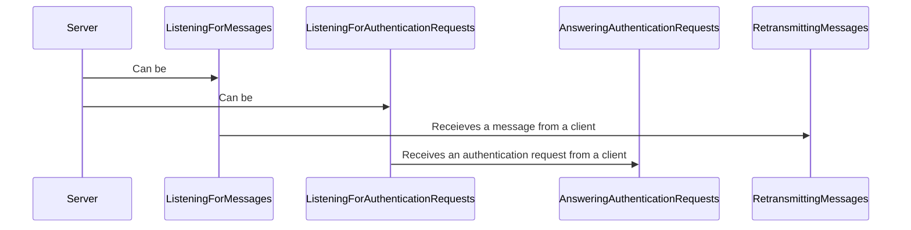

# UDP Multichat CLI Application

This chat app is a simple UDP client/server application that allows multiple clients
to connect to a server and send messages to each other. The server is able to handle
multiple clients at once and will broadcast messages to all connected clients.

## Quickstart

To get the system started you must first start the server. This can be done by running the server CLI application.
See [Server CLI](server) for more information.

Once you have a server clients can be started in order to interact with the server. See [Client CLI](client) for more information.

## Design

### Client CLI

The client CLI is a simple command line interface that allows the user to interact with the system.

### Server CLI

The server CLI is a simple command line interface that allows the for creating a server in the system that can be used by clients in order to send messages to be retransmitted to other registered users.

### Project structure

See [Code Documentation](/api/index.md) for more information.

### Messages between Client <-> Server

Client and server interchange messages in the form of JSONs. The JSONs are deserialized into code usable class objects that represent the messages. Because the messages are serialized into JSONs they can be sent over the network and deserialized into the same class objects on the other side. This allows for easy communication between the client and the server.

A client must be logged in to send messages to the server. The server will then broadcast the message to all other registered users.

### Authentication

The server has basic authentication with a user being able to:

- register
- login
- unregister
- logout

The user is able to send messages to the server. The server will then broadcast on the moment the message to all other users that
are registered. Messaegs are not stored by the server, just retransmitted, hence if a user is not online and logged in they will not receive the messages they have missed.

### Persistence

Registered users are persisted into an SQLite3 database. This allows for the server to be restarted and still have the registered users. This allows for user login functionality. This also means that a username must be unique and not registered.

## Basic functionality of a UDP Multichat

## Possible client states

## Possible server states

